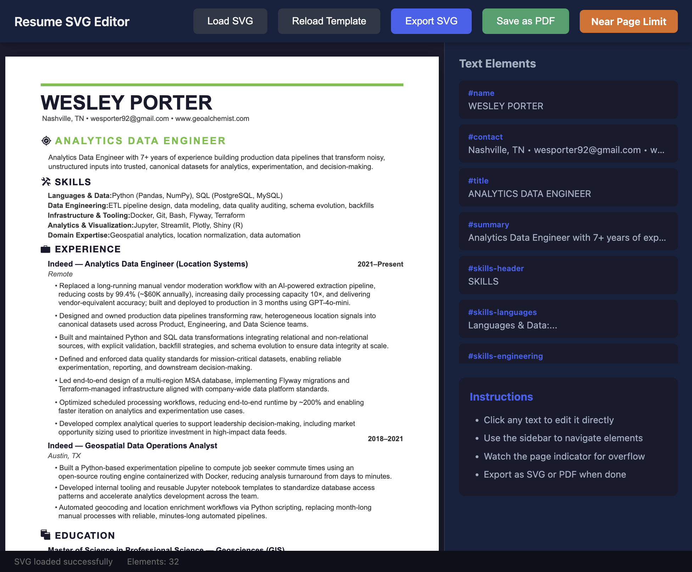

# Resume Forge

**Mírdain** — A minimalist SVG resume editor that runs entirely in the browser.



## Features

- Edit resume text directly in the browser
- Live preview with click-to-edit interface
- Visual page break indicator (letter size: 8.5" × 11")
- One-click PDF export
- No server required — runs entirely client-side

## Quick Start

1. Start a local server:
   ```bash
   ./serve.sh
   ```
   Or use any HTTP server:
   ```bash
   python3 -m http.server 8080
   ```

2. Open http://localhost:8080/svg-editor.html

3. Click any text element to edit, then click "Download PDF" to export.

## Files

| File | Description |
|------|-------------|
| `svg-editor.html` | Main editor application |
| `resume_template.svg` | Editable SVG resume template |
| `serve.sh` | Simple HTTP server script |
| `*.svg` | Section icons (education, experience, skills, objective) |

## Dependencies

All dependencies are loaded via CDN:
- [jsPDF](https://github.com/parallax/jsPDF) — PDF generation
- [svg2pdf.js](https://github.com/yWorks/svg2pdf.js) — SVG to PDF conversion

## License

MIT
